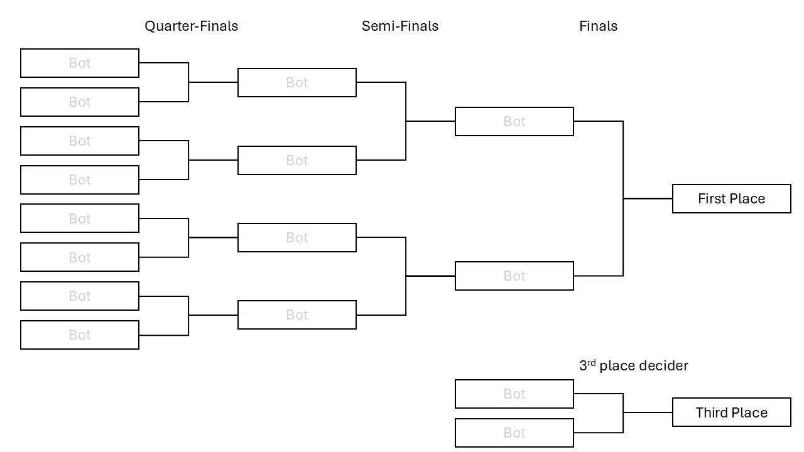

# BotStack 01
 
## The Game

This is a programming competition, framed within a game. A cross-over between [Buckshot Roulette](https://store.steampowered.com/app/2835570/Buckshot_Roulette/) (like Russian roulette) and the [Prisoner’s Dilemma](https://www.youtube.com/watch?v=mScpHTIi-kM), this game brings a balance of luck and strategy to challenge your ideas and programming ability.

## How It Works

### Shots

The central action in a game is a **shot**. For every shot, the round in the gun may be *live* or *blank*. At all times, you know the current number of live and blank bullets in the gun. Every player starts with 3 health, and each live shot will decrease the players health by one.

- Each action, you can chose to shoot either **yourself** or your **opponent**. Shooting yourself with a blank will continue your turn, allowing you to take another action, which can be used strategially to gain an advantage.

- Additionally, you can use an **item** before your turn. There are 5 different items, and you start the game with 2 items. Additionally, you gain 1 item every **reload**. The items in the game are the following:

   - <ins>**Peek the Current Bullet**</ins> - This shows you the current bullet loaded the gun - i.e. the one which will be fired next.
   - <ins>**Eject the Current Bullet**</ins> - This removes the current bullet from the gun, without firing it.
   - <ins>**Skip Enemy Turn**</ins> - This allows you to take another turn immediately after your current one regardless of the outcome of your current turn (except for a death).
   - <ins>**Health Kit**</ins> - This item adds one to your current health.
   - <ins>**Reload Gun**</ins> - This item immediately **reloads** the gun, but does *not* end your turn - you will be able to shoot after the reload.

### Reloads

Once the gun has run out of bullets, it will be reloaded up to 2 times in a round, making for a total of **3 gun-loads** (including the one at the beginning of the game). Using a reload item does *not* count toward this count. 

Whenever the gun is loaded, it will contain between 3 and 7 bullets, with a corresponding number of live bullets detailed below.

| Total number of bullets | 3 | 4 | 5 | 6 | 7 |
|-------------------------|---|---|---|---|---|
| Minimum live bullets    | 1 | 1 | 2 | 2 | 3 |
| Maximum live bullets    | 2 | 3 | 3 | 4 | 4 |

### Abstention

Along with reloads comes the second key mechnicaic - abstention. On the first turn of each player after a reload, they have the opportunity to request an abstention. If the other player accepts this request, the round will end. 

### Rounds

Rounds are the layer up from reloads. As mentioned before, rounds can end after 3 total gun-loads. However, there are more ending conditions:

- <ins>**Player Death**</ins> - If on player runs out of health, the round ends, and the other player gains credit for a **win**
- <ins>**Abstention**</ins> - If the round ends due to abstention, both players gain credit for a **draw**
- <ins>**Run out of Bullets**</ins> - If the gun runs out of bullets afer 2 reloads, the rounnd will end with neither player gaining any credit

### Matches

The overall game consists of up to three rounds, ending as soon as one of the below criteria are met.

- <ins>**Player reaches two Wins**</ins> - If either player reaches two wins, that player wins the match.
- <ins>**Two Draws**</ins> - If two draws are completed, the match ends in a draw
- <ins>**Three Rounds Complete**</ins> - If 3 rounds complete without either of the previous two conditions (i.e. 1 **win** each, and 1 **draw**), the game ends in a **loss** for both players 

The points gain/loss are shown below, which will become relevant in the next section.

| Points       | Player 1 | Player 2 |
|--------------|----------|----------|
| Player 1 win | +3       | +0       |
| Player 2 win | +0       | +3       |
| Draw         | +1       | +1       |
| Loss         | -1       | -1       |

## The Format

So, with the game explained, how does one bot triumph above the rest. Once submissions are closed, all bots will be run against each-other in a multi-match, round robin format. This means every bot will play against every bot several times over. The points from these matches will be summed up, to create an initial ranking. This stage will be run behind closed doors. 

After this, the top **eight** bots will proceeed to an elimination bracket, with each bot playing another bot in a single match, and the winner progressing to the next stage. These matches will be available to watch (more details in later communication).

** The final two matches - to determine 1st-4th place - will be **Best-of-Three** matches instead of **Best-of-One**

## Tips and Tricks

- The game can be tested in bot-vs-player mode, or bot-vs-bot mode. 
  - Build commands for both cases are found in the `build_cmds.txt` file.
- Read the function documentation in the `player1.c` and `player2.c` files, as these provide some key technical details - these are the only files you need to modify.
- `static` variables could be used to maintain information between actions, allowing you to track the state of the game and figure out your opponents actions or decision making.